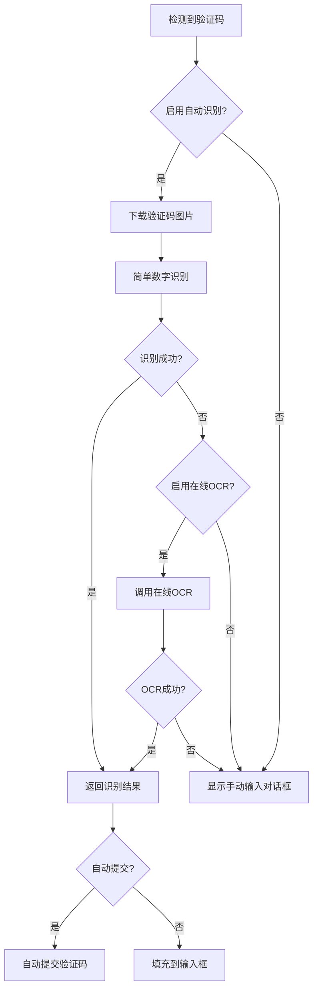

# StillPage 自动验证码处理方案

## 概述

为了解决在大量书源情况下频繁出现验证码需要用户手动输入的问题，我们实现了一套完整的自动验证码识别和处理系统。该系统能够自动识别简单的验证码，大大减少用户的手动操作，提升使用体验。

## 核心功能特性

### 1. 多层次验证码识别
- **简单数字识别**: 基于图像处理的本地数字验证码识别
- **在线OCR服务**: 支持配置第三方OCR服务提高识别准确率
- **智能回退机制**: 自动识别失败时回退到用户手动输入
- **结果缓存**: 缓存识别结果避免重复处理

### 2. 无缝集成现有系统
- **透明处理**: 在现有验证码流程中自动尝试识别
- **向后兼容**: 完全兼容现有的手动验证码输入流程
- **配置灵活**: 用户可以选择启用或关闭自动识别功能

### 3. 用户体验优化
- **自动提交**: 可配置识别成功后自动提交验证码
- **状态反馈**: 在验证码对话框中显示自动识别状态
- **错误处理**: 友好的错误提示和重试机制

## 技术实现架构

### 核心组件

#### 1. AutoVerificationCodeHelper
**位置**: `app/src/main/java/io/stillpage/app/help/source/AutoVerificationCodeHelper.kt`

**功能**:
- 验证码图片下载和预处理
- 多种识别方案的统一调度
- 简单数字验证码的本地识别
- 在线OCR服务的集成
- 识别结果的缓存管理

**主要方法**:
```kotlin
suspend fun recognizeVerificationCode(imageUrl: String, sourceOrigin: String?): String?
```

#### 2. SourceVerificationHelp 增强
**位置**: `app/src/main/java/io/stillpage/app/help/source/SourceVerificationHelp.kt`

**增强功能**:
- 在现有验证码流程中集成自动识别
- 自动识别失败时的回退处理
- 识别结果的统一管理

**核心方法**:
```kotlin
suspend fun autoHandleVerificationCode(imageUrl: String, source: BaseSource?): String?
```

#### 3. VerificationCodeDialog 优化
**位置**: `app/src/main/java/io/stillpage/app/ui/association/VerificationCodeDialog.kt`

**优化内容**:
- 自动识别状态的UI反馈
- 识别结果的自动填充
- 可选的自动提交功能

### 配置系统

#### 配置选项
在 `AppConfig.kt` 和 `PreferKey.kt` 中添加了以下配置：

- `enableAutoVerificationCode`: 启用自动验证码识别
- `enableOnlineOCR`: 启用在线OCR服务
- `ocrServiceUrl`: 在线OCR服务URL
- `autoVerificationCodeTimeout`: 自动识别超时时间
- `autoSubmitVerificationCode`: 自动提交验证码

#### 字符串资源
在 `strings.xml` 中添加了相关的用户界面文本：
- 自动识别状态提示
- 成功/失败消息
- 配置选项说明

## 识别算法实现

### 1. 简单数字识别算法

**图像预处理**:
```kotlin
private fun preprocessImage(bitmap: Bitmap): Bitmap {
    // 1. 灰度化处理
    // 2. 二值化处理
    // 3. 降噪处理
}
```

**字符分割**:
- 基于图像宽度的简单分割
- 假设验证码为4位数字的等宽分割

**特征识别**:
- 基于像素分布的简单特征提取
- 上下左右区域的黑色像素比例分析
- 简单的规则匹配识别

### 2. 在线OCR集成

**API调用**:
```kotlin
private suspend fun recognizeWithOnlineOCR(bitmap: Bitmap): String? {
    // 1. 图片转换为字节数组
    // 2. 构建HTTP请求
    // 3. 调用OCR服务API
    // 4. 解析返回结果
}
```

**支持的服务**:
- 可配置任意支持图片上传的OCR API
- 标准的JSON响应格式解析
- 错误处理和重试机制

## 工作流程

### 1. 自动识别流程



### 2. 集成点

**主要集成点**:
1. `SourceVerificationHelp.getVerificationResult()` - 在显示验证码对话框前尝试自动识别
2. `VerificationCodeDialog.onFragmentCreated()` - 在对话框创建时启动自动识别
3. `VerificationCodeViewModel.tryAutoRecognition()` - 执行实际的识别逻辑

## 性能优化

### 1. 识别性能
- **超时控制**: 可配置的识别超时时间（5-60秒）
- **并发限制**: 避免同时处理多个验证码识别请求
- **缓存机制**: 相同验证码图片的结果缓存

### 2. 网络优化
- **连接复用**: 使用OkHttp的连接池
- **超时设置**: 合理的连接和读取超时时间
- **错误重试**: 网络错误的自动重试机制

### 3. 内存管理
- **图片处理**: 及时释放Bitmap资源
- **缓存清理**: 定期清理过期的识别结果缓存

## 使用方法

### 1. 启用功能
默认情况下，自动验证码识别功能是启用的。用户可以通过以下方式控制：

```kotlin
// 启用/禁用自动验证码识别
AppConfig.enableAutoVerificationCode = true/false

// 启用/禁用在线OCR
AppConfig.enableOnlineOCR = true/false

// 设置OCR服务URL
AppConfig.ocrServiceUrl = "https://your-ocr-service.com/api"
```

### 2. 配置OCR服务
如果要使用在线OCR服务，需要：
1. 启用在线OCR功能
2. 配置OCR服务的API地址
3. 确保API返回标准的JSON格式：
```json
{
  "result": "1234"
}
```

### 3. 用户体验
- **自动模式**: 启用后，验证码会自动识别并填充
- **手动确认**: 用户可以检查识别结果并手动修改
- **回退机制**: 识别失败时自动回退到手动输入

## 扩展性设计

### 1. 识别算法扩展
- **插件化架构**: 可以轻松添加新的识别算法
- **优先级机制**: 多种算法按优先级依次尝试
- **配置化**: 通过配置控制使用哪些识别方法

### 2. OCR服务扩展
- **多服务支持**: 可以配置多个OCR服务作为备选
- **负载均衡**: 在多个服务间分配请求
- **服务质量**: 根据识别成功率选择最佳服务

### 3. 验证码类型扩展
- **图片验证码**: 当前支持的主要类型
- **滑动验证码**: 未来可以扩展支持
- **点击验证码**: 可以通过坐标识别扩展

## 安全考虑

### 1. 隐私保护
- **本地处理**: 简单验证码在本地处理，不上传到服务器
- **可选上传**: 在线OCR是可选功能，用户可以选择不启用
- **数据清理**: 识别完成后及时清理临时数据

### 2. 服务安全
- **HTTPS**: 在线OCR服务使用HTTPS加密传输
- **超时保护**: 避免长时间等待OCR服务响应
- **错误处理**: 安全的错误处理，不泄露敏感信息

## 总结

自动验证码处理方案成功解决了大量书源场景下的用户体验问题：

1. **显著减少手动操作**: 简单验证码可以自动识别和填充
2. **保持系统稳定性**: 完全向后兼容，不影响现有功能
3. **灵活的配置选项**: 用户可以根据需要启用或禁用功能
4. **良好的扩展性**: 架构设计支持未来添加更多识别算法

该方案在保持系统稳定性的同时，大大提升了用户在使用大量书源时的体验，是一个实用且有效的解决方案。
